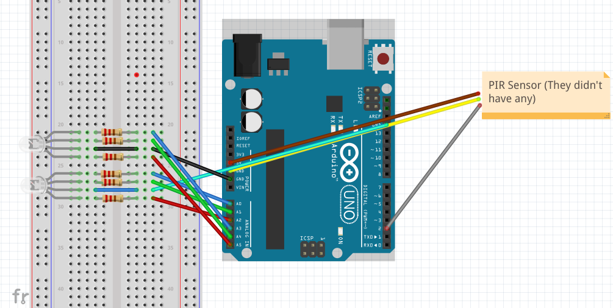

# P00: Project 1

**Author(s)**: *Gerardo Soto & Aaron Christson*

**Google Document**: *https://docs.google.com/document/d/1OnYtF9OHpxGGOFgn7rhAzPf1oIvjDrZAU22cBT8vuME/edit?usp=sharing*

---
## Purpose

In no more than one paragraph, describe the problem your product will solve, and how.

The problem we were having was that throughout the day you might be feeling sad because of something that happened or something that is about to happen. In order to regulate this, we will be making a motion "smart" lamp that turns on with motion and adjusts its light depending on the time of day to maximize positive feelings. It will also be able to react to the weather and shine the best possible light for what the weather is like.

## Initial Design Plan

Our initial design plan consists of 1 arduino, long enough wiring, 2 rgb lights, 2 motion sensors, and a small power supply to give power to the lights.

The motion sensor will be attached to the base of a door where it will detect whether or not someone has walked into the room, making the lights turn on. Another sensor will detect movement within the room, resetting the time before the fade back off. The purpose of the lights is to create an ambiance and bring the right feeling to the user during any given time of day. The arduino will be constantly keeping time in the background ensuring that the right light colors are activated when the user enters the room. If it is morning time, for example, the light will emit a pink/orange hue, signifying that it is a new day, and giving the user a sense of life and brightness. Another example can be night when the colors emitted can be a cool shade of purple and cyan, giving the user a light source that is not too blinding. We hope to allow the user an interface to adjust hues and brightness as they wish, as well as more features that we have in mind.

## Files

README.md - Contains informtion about the project.

example-README.md - Contains a template for the readme file.

LICENSE - license file

images - a directory that contains an image. (this was here when we joined the github classroom.)

## References

*https://learn.adafruit.com/pir-passive-infrared-proximity-motion-sensor/using-a-pir-w-arduino* - We used this to file to understand how to connect a motion sensor to an arduino.

*https://learn.adafruit.com/adafruit-arduino-lesson-3-rgb-leds/parts* - We used this to understand how to connect an rgb led light to an arduino.

*https://www.tweaking4all.com/hardware/pir-sensor/* - Used this to understand how the PIR Sensor works and how to tune it. 

